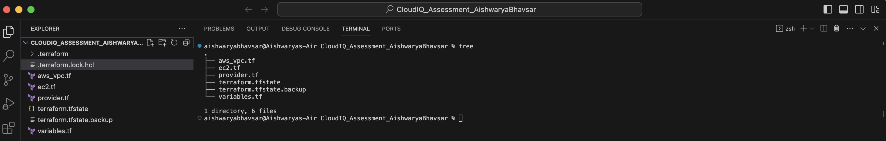

# CloudIQ_Assessment_1_AishwaryaBhavsar
1. Write an exercise in Terraform to create the below resources in AWS.

<h1>Project Structure</h1> 
 

<h1>VPC Components</h1> 

**1. Create VPC:** A VPC named CloudIQ-Sample-VPC has been created with CIDR range 172.0.0.0/16 
 
**2. Private Subnets:** 2 private subnets are created. 
**3. Public Subnets:** 2 public subnets are created. 
 
**4. EC2 Instances:** t2.micro instances created in all the subnets. 
 
**5. Internet Gateway:** Since our public subnets have resources like EC2 instances, we will be allowing our resources to connect to the internet. 
 
**6. Route Table:** Each subnet should be associated with a route table to control network traffic. 
 

<h1>Terraform Workflow Steps</h1> 

**Step 1: _terraform init_:** 
* Initializes terraform environment and plugins 
* A hidden folder called _.terraform_ will be generated, it contains all the plugins for your platform 

**Step 2: _terraform validate_:**
* To reformat your code and run some basic validations. 

**Step 3: _terraform plan_:**
* The terraform plan command creates an execution plan, which lets you preview the changes that Terraform plans to make to your infrastructure. 

**Step 4: _terraform apply_** 
* Deploy resources to your AWS console.
 

**Step 5: _terraform destroy_**
* This will destroy all the resources/objects created in the AWS console and will help tear down the environment.

